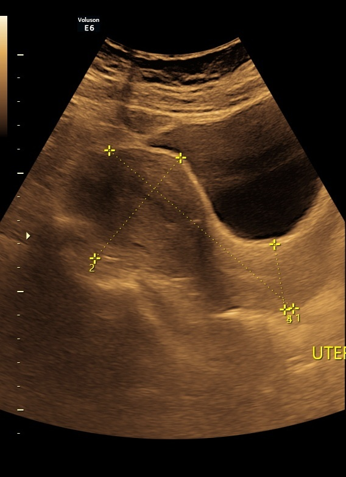
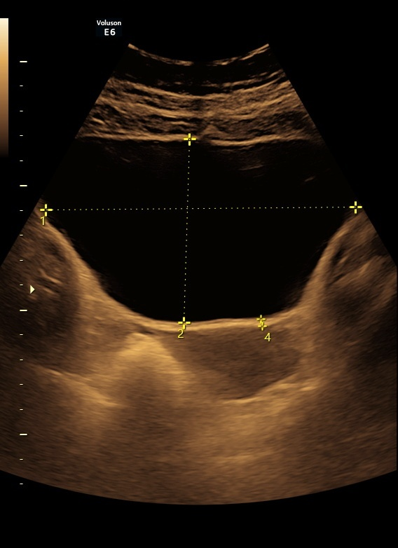
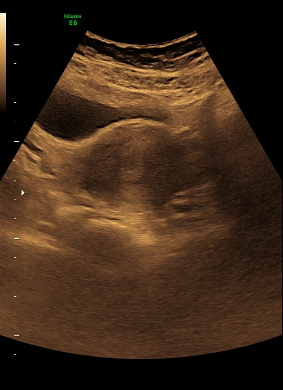
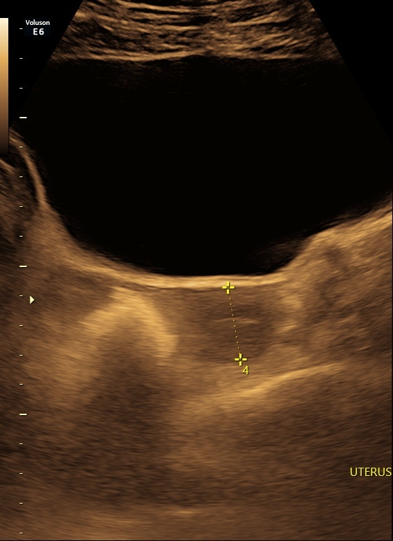
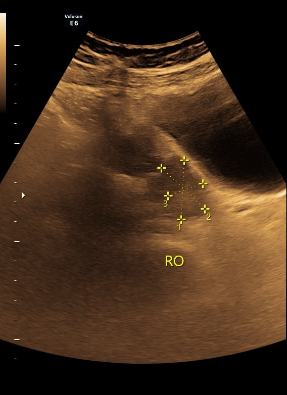

# Learnable 2D Gaussian Filters for Computationally Efficient Abdominal Organ Classification

This project explores the integration of learnable 2D Gaussian filters with standard and custom CNN architectures to improve the classification of abdominal ultrasound images. The work focuses on enhancing computational efficiency and performance in medical imaging classification tasks.

## 🚀 Key Features
- Implementation of a learnable 2D Gaussian filter layer.
- Comparative analysis using:
  - DenseNet121
  - AlexNet
  - ResNet50
  - VGG16
  - Custom CNN
  - Custom CNN + Learnable 2D Gaussian Filter
- Target task: Abdominal organ classification from ultrasound images.
- Optimized for performance and interpretability.

## 📄 Paper

> [Download Full Paper (PDF)](Results/SPIE2025_GaussFilters_Shaila.pdf)  
> *"Learnable 2D Gaussian Filters for Computationally Efficient Abdominal Organ Classification"*  
> Presented at SPIE 2025 Conference on Real-Time Image Processing and Deep Learning  
> *(Manuscript not yet published — PDF uploaded for reference only)*

## 🧪 Dataset
- Custom curated ultrasound dataset (preprocessed and balanced).
- Not publicly available due to sensitivity and privacy constraints.
- Contact for access if needed for research collaboration.
## 🖼️ Sample Ultrasound Images

<p align="center">
  
  
  
</p>

<p align="center">
  
  
</p>

📊 Results – Model Performance Summary

🧠 AlexNet
Accuracy Log,
Classification Report

🧠 Custom CNN
Accuracy Log,
Classification Report

🧠 DenseNet121
Accuracy Log,
Classification Report

🧠 GaussNet (Custom CNN + Learnable 2D Gaussian)
Accuracy Log,
Classification Report

🧠 ResNet50
Accuracy Log,
Classification Report

🧠 VGG16
Accuracy Log,
Classification Report

## 📁 Project Structure

```
├── assets/                         # Folder containing sample dataset images
│   ├── healthy_example1.png
│   ├── abnormal_example1.png
├── Results                         # Folder containing images of results
│   ├── alexnet_acc.png
│   ├── alexnet_class.png
│   ├── custom_cnn_acc
|   ├── custom_cnn_class
|   ├── dense_acc
|   ├── dense_acc
|   ├── gauss_acc
|   ├── gauss_class
|   ├── res_acc
|   ├── res_class
|   ├── vgg_acc
|   ├── vgg_class
├── alexnet.py                      # Training and evaluation using AlexNet
├── dense-121.py                    # Training and evaluation using DenseNet121
├── resnet50_paper_fif.py           # Training and evaluation using ResNet50
├── vgg_16_PAPER_fif.py             # Training and evaluation using VGG16
├── custom_cnn_paper_fif.py         # Training and evaluation of custom CNN
├── gauss_final.py                  # Custom CNN with Learnable 2D Gaussian layer
├── gaussiand2D_layer_pytorch.py    # Script defining the learnable 2D Gaussian layer
├── create_dataset.py               # Dataset loading and preprocessing
└── requirements.txt/               # Required Python dependencies
└── .gitignore                      # Specifies files and folders to be ignored by Git
├── README.md                       # Reading this!
```

## 📚 References

1. Huang, G., Liu, Z., Van Der Maaten, L., & Weinberger, K.  
   “Densely Connected Convolutional Networks.” [arXiv:1608.06993](https://arxiv.org/pdf/1608.06993)

2. Simonyan, K., & Zisserman, A.  
   “Very Deep Convolutional Networks for Large-Scale Image Recognition.” [arXiv:1409.1556](https://arxiv.org/pdf/1409.1556)

3. He, K., Zhang, X., Ren, S., & Sun, J.  
   “Deep Residual Learning for Image Recognition.” [arXiv:1512.03385](https://arxiv.org/pdf/1512.03385)

4. Biswas, S., Ayna, C. O., & Gurbuz, A. C.  
   “PLFNets: Interpretable Complex Valued Parameterized Filters...” [IEEE Paper](https://doi.org/10.1109/trs.2024.3486183)

5. Papers with Code  
   “ImageNet Classification with Deep CNNs.” [Link](https://paperswithcode.com/paper/imagenet-classification-with-deep)

6. Persson, A.  
   “Aladdin Persson - YouTube.” [YouTube](https://www.youtube.com/@AladdinPersson)


---

## 👥 Authors

- **Sifat Z. Karim** — Graduate Student, Mississippi State University  
  📧 [sifatzinakarim1992@gmail.com](mailto:sifatzinakarim1992@gmail.com)  
  🧑‍💻 GitHub: [@sifat1992](https://github.com/sifat1992)

- **Sabyasachi Biswas** — Graduate Student, Mississippi State University  
  📧 [sabyasachi1406147gmail.com](mailto:sabyasachi1406147gmail.com).
  🧑‍💻 GitHub: [Sabyasachi1406147](https://github.com/Sabyasachi1406147)

---

## 🤝 Contact

For questions, suggestions, or collaboration opportunities, feel free to reach out!  
I’m happy to receive feedback and open to connecting with fellow researchers.


---

## 💡 Notes

- This is my **first GitHub repository**, so **feedback and suggestions are welcome**!  
- Results may slightly vary between runs due to **shuffling in the training set** — randomness can affect performance metrics.

Thanks for checking out my work! 🌱


